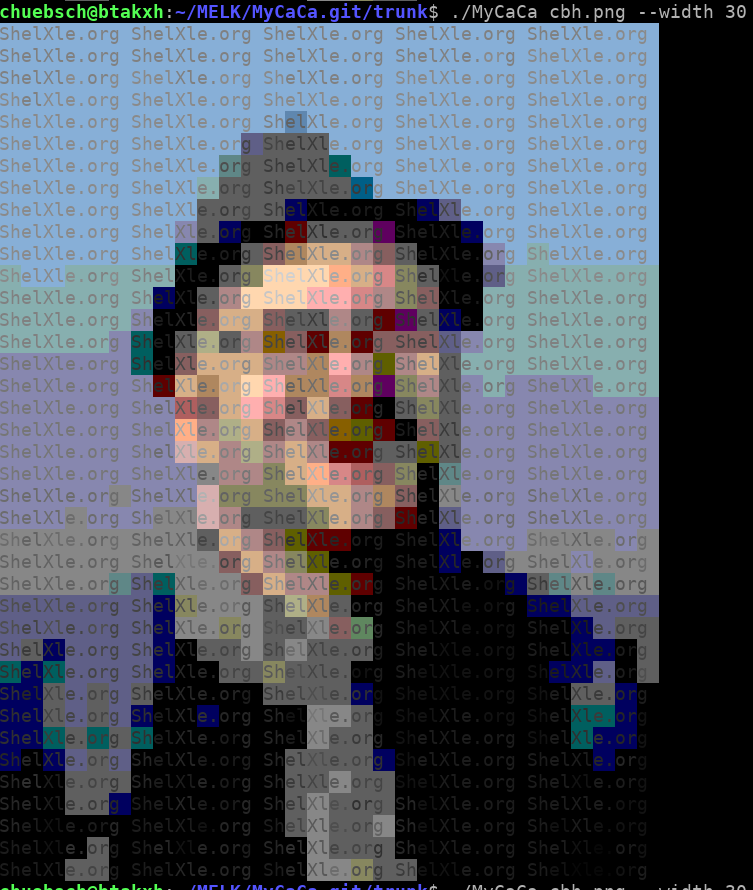

# MyCaCa
Colored ASCII art representation of small images on the shell using escape sequences

## Idea

[Link](https://en.wikipedia.org/wiki/ANSI_escape_code)
there is a library called libcaca but I found the results not so satifying so...


## Compiling the Source

```
qmake
make
``` 
or
```
/usr/lib/x86_64-linux-gnu/qt5/bin/qmake
make
```

## Usage

```
./MyCaCa cbh.png --width 32 
```
## Example


### from this: 


